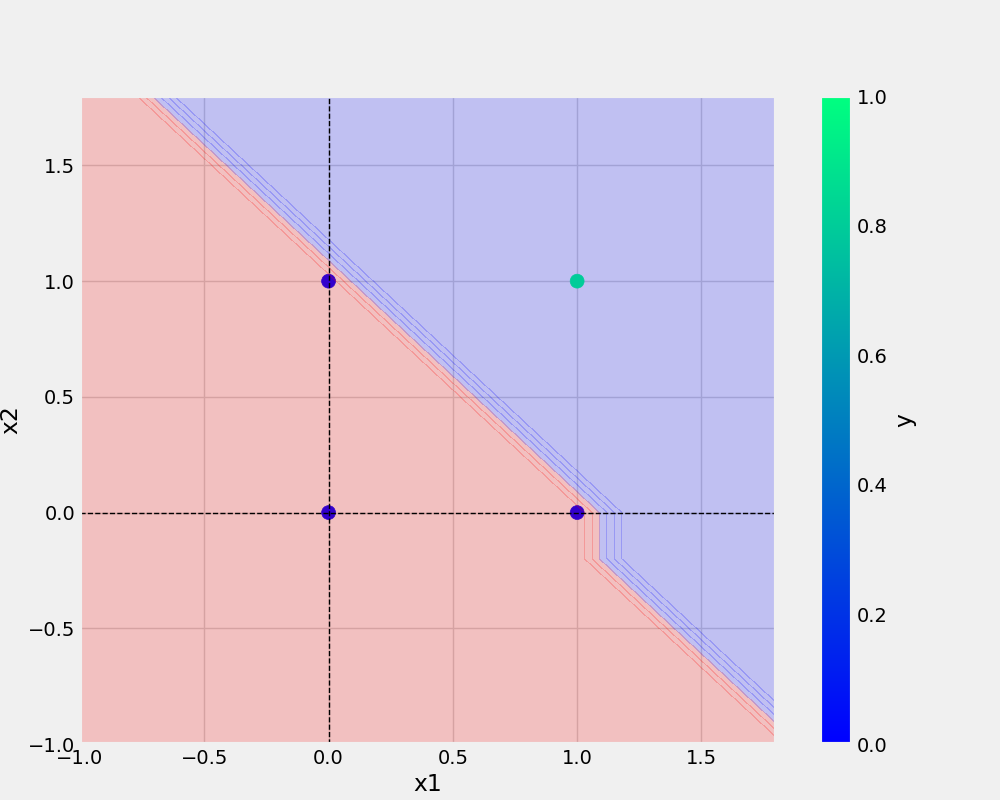

# Perceptron

Implementing Perceptron

```Bash commands

git add . && git commit -m "doctring updated" && git push origin main
```

## Add URL -

[Git handbook](https://guides.github.com/introduction/git-handbook/)

## Add Image -



## Python Code

```python
    def main(data,eta,epochs,filename,plotFilename):

        df = pd.DataFrame(data)

        logging.info(f"This is actual DataFrame {df}")

        X,y = prepare_data(df)

        model = Perceptron(eta=eta,epochs=epochs)
        model.fit(X, y)

        _ = model.total_loss()

        save_model(model,filename=filename)
        save_plot(df,plotFilename,model)
```
